Сдача проектной работы 6
В этом спринте вас ждёт кейс компании FinUnion Group — федеральной финансовой организации, которая купила региональный банк RetailBank.
О компании
FinUnion Group работает с физическими и юридическими лицами: открывает счета, выпускает карты, выдаёт кредиты, принимает платежи, обслуживает клиентов в офисах, мобильном и веб-приложениях.
У RetailBank обширная клиентская база в нескольких регионах России, собственные CRM и АБС, отдельное хранилище отчётности и локальные интеграции с партнёрами.
После сделки бизнес хочет объединить клиентские данные, продуктовую линейку, отчётность и каналы обслуживания. Клиенты RetailBank должны постепенно получить доступ к продуктам FinUnion, а менеджеры FinUnion должны видеть единую картину по клиентам, продуктам, счетам, картам, кредитам и обращениям.
Сейчас данные двух организаций разрознены: 
Одни и те же клиенты могут быть заведены в обеих системах с разными идентификаторами.
Форматы данных отличаются.
Отчётность строится отдельно.
Справочники продуктов, тарифов, отделений и клиентских сегментов не синхронизированы.
Если ничего не изменить, возникнет дублирование клиентов, ошибки в отчётности, рост ручных сверок, риски нарушения требований ИБ и задержки в интеграции новых продуктов, а ещё не получится построить единый клиентский профиль.
Структура компании
В компании несколько направлений деятельности:
Розничный бизнес: карты, счета, вклады, кредиты физических лиц
Малый и средний бизнес: расчётные счета, платежи, кредитование бизнеса
Контактный центр: обращения клиентов, претензии, консультации
Риск-менеджмент: оценка кредитного риска, скоринг, антифрод
Финансовый департамент: управленческая и регуляторная отчётность
Data Office: качество данных, каталог данных, правила владения данными
ИТ: поддержка АБС, CRM, DWH, интеграций и каналов обслуживания
Ландшафт компании As-Is:
Система	FinUnion	RetailBank	Проблема
CRM	FU CRM	RB CRM	Дубли клиентов, разные идентификаторы
Core Banking / АБС	FU Core	RB Core	Разные модели счетов, договоров и операций
Карточный процессинг	FU Cards	RB Cards	Разные статусы карт и тарифы
Кредитная система	FU Loans	RB Loans	Разные правила кредитных продуктов
DWH	FU DWH	RB DWH	Несогласованная отчётность
BI	FU BI	RB BI	Разные метрики и витрины
Data Lake	Частично есть	Нет	Неструктурированные данные децентрализованы
Интеграционная шина	ESB	Point-to-point-интеграции	Нет единого подхода к потокам
Каталог данных	Нет	Нет	Нет прозрачного lineage и владельцев данных
Как отправную точку для анализа можно использовать As-Is-диаграмму:

```mermaid
flowchart LR
    %% =========================================================
    %% Архитектура As-Is банков FinUnion и RetailBank
    %% =========================================================

    %% ---------------------------------------------------------
    %% Внешние участники
    %% ---------------------------------------------------------

    Client([Клиент])
    Employee([Сотрудник<br/>банка])
    Analyst([Аналитик])
    Regulator([Регулятор])

    %% ---------------------------------------------------------
    %% FinUnion
    %% ---------------------------------------------------------

    subgraph FinUnion["FinUnion"]
        direction TB

        F_ESB["FinUnion ESB"]
        F_CRM["FinUnion CRM"]
        F_Core["FinUnion Core Banking"]
        F_Cards["Карты FinUnion"]
        F_Loans["FU Займствования<br/>FinUnio"]
        F_Lake[("Займствования FinUnion<br/>Data Lake")]
        F_DWH[("Займствования FinUnion DWH")]
        F_BI["Займствования<br/>FinUnion BI"]
    end

    %% ---------------------------------------------------------
    %% RetailBank
    %% ---------------------------------------------------------

    subgraph RetailBank["RetailBank"]
        direction TB

        R_CRM["RetailBank CRM"]
        R_Core["RetailBank Core Banking"]
        R_Loans["Займствования RetailBank<br/>Loans"]
        R_Cards["Карты RetailBank"]
        R_DWH[("RetailBank DWH")]
        R_BI["RetailBank BI"]
        P2P["Point-to-point интеграции"]
    end

    %% ---------------------------------------------------------
    %% Взаимодействие клиентов и сотрудников с CRM
    %% ---------------------------------------------------------

    Client -->|"Обращения<br/>и данные клиента"| F_CRM
    Client -->|"Обращения<br/>и данные клиента"| R_CRM

    Employee -->|"Работа с клиентом"| F_CRM
    Employee -->|"Работа с клиентом"| R_CRM

    %% ---------------------------------------------------------
    %% FinUnion: ESB и CRM
    %% ---------------------------------------------------------

    F_ESB -.-> F_CRM
    F_ESB -.-> F_Core
    F_ESB -.-> F_Loans
    F_ESB -.-> F_Cards
    F_CRM -.-> Note2

    F_CRM -->|"Данные клиента<br/>и договоры"| F_Core
    F_CRM -->|"Документы и события"| F_Lake

    F_CRM -->|"Заявки и данные<br/>заёмщика"| F_Loans
    F_Loans -->|"Кредитный портфель"| F_DWH

    %% ---------------------------------------------------------
    %% FinUnion: Core Banking и карты
    %% ---------------------------------------------------------

    F_Core -->|"Счета<br/>и карты"| F_Cards
    F_Core -->|"Счета,<br/>платежи, договоры"| F_DWH

    F_Cards -->|"События<br/>карточных операций"| F_Lake
    F_Cards -->|"Карточные<br/>операции"| F_DWH

    F_Core -->|"Исторические<br/>выгрузки"| F_Lake
    F_Core -->|"Batch-выгрузки"| F_Loans

    %% ---------------------------------------------------------
    %% FinUnion: аналитика и отчетность
    %% ---------------------------------------------------------


    F_DWH -->|"Витрины"| F_BI

    F_DWH -->|"Отчётность"| Regulator
    F_BI -->|"Отчёты<br/>FinUnion"| Regulator

    Analyst -->|"Отчеты FinUnion BI"| F_BI
    

    %% ---------------------------------------------------------
    %% RetailBank: CRM и Core Banking
    %% ---------------------------------------------------------

    R_CRM -->|"Данные клиента<br/>и договоры"| R_Core
    R_CRM -->|"Заявки<br/>и данные заёмщика"| R_Loans
    R_Core -->|"Счета,<br/>платежи, договоры"| R_Loans

    %% ---------------------------------------------------------
    %% RetailBank: Core Banking и карты
    %% ---------------------------------------------------------

    R_Core -->|"Счета<br/>и карты"| R_Cards
    R_Core -->|"Batch-выгрузки"| R_DWH

    R_Cards -->|"Карточные<br/>операции"| R_DWH
    
    %% ---------------------------------------------------------
    %% RetailBank: кредиты, DWH и BI
    %% ---------------------------------------------------------

    R_Loans -->|"Кредитный<br/>портфель"| R_DWH
    R_DWH -->|"Витрины"| R_BI
    
    R_DWH -->|"Отчётность"| Regulator

    Analyst -->|"Отчеты RetailBank BI"| R_BI
    

    %% ---------------------------------------------------------
    %% Point-to-point интеграции
    %% ---------------------------------------------------------

    P2P -.-> R_CRM
    P2P -.-> R_Core
    P2P -.-> R_Cards
    P2P -.-> R_Loans

   

    %% ---------------------------------------------------------
    %% Визуальные замечания
    %% ---------------------------------------------------------

    Note1["Data Lake есть только частично:<br/>нет единого каталога,<br/>линейности и правил качества данных"]
    Note2["Данные клиентов частично<br/>дублируются с RetailBank CRM"]
    Note3["Много точечных интеграций;<br/>нет централизованного<br/>управления потоками"]
    Note4["Отчётность считается отдельно,<br/>метрики не совпадают"]
    Note5["У RetailBank нет Data Lake:<br/>исторические и аналитические данные<br/>хранятся в RetailBank DWH<br/>и выгрузках"]

    Note1 -.-> F_Lake
    Note2 -.-> RetailBank
    Note3 -.-> RetailBank
    Note4 -.-> R_DWH
    Note5 -.-> R_DWH

    %% ---------------------------------------------------------
    %% Стили
    %% ---------------------------------------------------------

    classDef system fill:#b7c78f,stroke:#a5b57d,color:#222,stroke-width:1px;
    classDef data fill:#788c4f,stroke:#667a42,color:#fff,stroke-width:1px;
    classDef actor fill:#ffffff,stroke:#444,color:#222,stroke-width:1px;
    classDef note fill:#fff5a8,stroke:#e5c928,color:#222,stroke-width:1px;
    classDef integration fill:#b7c78f,stroke:#a5b57d,color:#222,stroke-width:1px;

    class F_ESB,F_CRM,F_Core,F_Cards,F_Loans,F_BI system;
    class R_CRM,R_Core,R_Loans,R_Cards,R_BI,P2P integration;
    class F_Lake,F_DWH,R_DWH data;
    class Client,Employee,Analyst,Regulator actor;
    class Note1,Note2,Note3,Note4,Note5 note;

    style FinUnion fill:#fafafa,stroke:#b7c78f,stroke-width:2px
    style RetailBank fill:#fafafa,stroke:#b7c78f,stroke-width:2px
```

Стартовые данные и ограничения
Стартовые сущности данных
В проекте есть несколько очевидных сущностей: клиент, счёт, карта, кредит, договор, транзакция, платёж, продукт, обращение клиента и справочник.
Вам нужно самостоятельно определить итоговый набор ключевых сущностей, уточнить их атрибуты, связи, источники и проблемы качества данных.
Ограничения
Полная остановка клиентских сервисов недопустима.
Нельзя за один шаг заменить все системы RetailBank.
Требуется сохранить корректность финансовых данных.
Персональные и финансовые данные должны быть защищены.
Аналитика не должна создавать нагрузку на операционные системы.
Нужно обеспечить трассируемость происхождения данных.
Промежуточный результат нужен через 3 месяца.
Целевой результат нужен через 12 месяцев.
Решения должны учитывать банковскую специфику и могут опираться на BIAN как отраслевую референсную модель банковских доменов.
Цели бизнеса
FinUnion Group нужно спроектировать целевую архитектуру данных после слияния с RetailBank.
Архитектура должна позволить:
получить единый профиль клиента;
определить мастер-системы для ключевых сущностей;
синхронизировать данные между системами в переходный период;
обеспечить корректную управленческую и регуляторную отчётность;
разделить операционные и аналитические нагрузки;
подготовить целевую платформу данных;
выполнить миграцию без остановки клиентских сервисов;
использовать BIAN как ориентир для унификации банковских сущностей и границ доменов данных.
Промежуточное состояние через три месяца
Объединённая компания должна получить минимально работоспособный ландшафт данных для совместной работы FinUnion и RetailBank.
К промежуточному состоянию нужно обеспечить:
единый клиентский идентификатор;
правила сопоставления клиентов FinUnion и RetailBank;
матрицу мастер-систем по ключевым сущностям;
временные потоки данных между системами;
единую управленческую отчётность по клиентам, счетам, продуктам и операциям;
контроль качества данных для критичных сущностей;
минимальный набор витрин для BI;
BIAN-маппинг для ключевых банковских сущностей;
план дальнейшей миграции.
Финальное состояние через год
Через год компания должна перейти к целевой архитектуре данных.
Финальное состояние должно включать:
единую модель ключевых данных;
назначенные мастер-системы;
централизованный MDM для клиентских и справочных данных;
разделение OLTP и OLAP-нагрузок;
DWH для регламентированной отчётности;
Data Lakehouse для больших исторических и событийных данных;
каталог данных и lineage;
управляемые ETL/ELT-пайплайны;
план отключения дублирующих legacy-систем RetailBank;
понятные правила владения данными;
целевые домены данных, согласованные с бизнес-областями и BIAN.
Что нужно сделать
В проекте предусмотрено четыре задания:
Проанализировать данные, сущности, критичность и типы хранилищ.
Определить мастер-системы и спроектировать потоки данных.
Спроектировать целевую архитектуру данных и аналитическую платформу.
Подготовить план миграции, cutover-план и технологическую дорожную карту.
Проектную работу нужно сдать в Git-репозитории. Создайте публичный репозиторий в GitHub и назовите его Solution-FinUnion-Data-Merger.
Решение каждого задания нужно загрузить в отдельную директорию: Task1, Task2, Task3 и Task4.

Solution-FinUnion-Data-Merger/
├── Task1/
│   ├── README.md
│   ├── entities.md
│   ├── logical-data-model.md
│   ├── data-classification.md
│   ├── storage-strategy.md
│   ├── reference-model.md
│   └── diagrams/
├── Task2/
│   ├── README.md
│   ├── master-systems.md
│   ├── data-ownership.md
│   ├── data-flows.md
│   ├── data-flow-management.md
│   ├── data-dependencies.md
│   └── diagrams/
├── Task3/
│   ├── README.md
│   ├── target-data-architecture.md
│   ├── architecture-options.md
│   ├── dwh-lakehouse.md
│   ├── data-pipelines.md
│   ├── analytical-model.md
│   ├── data-products.md
│   └── diagrams/
└── Task4/
    ├── README.md
    ├── migration-target-state.md
    ├── migration-plan.md
    ├── cutover-plan.md
    ├── migration-risks.md
    ├── tech-roadmap.md
    └── diagrams/
