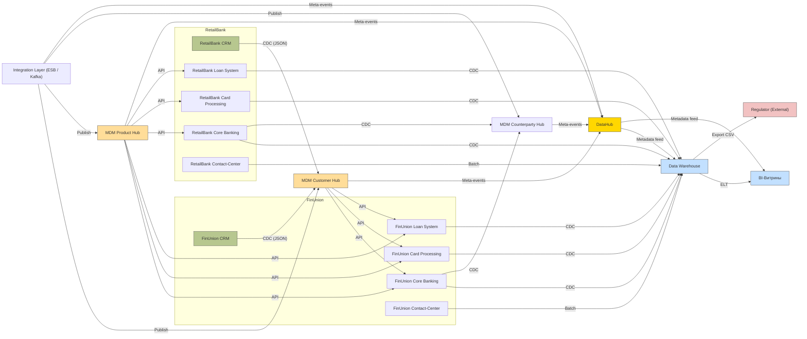

# Диаграмма потоков данных (уровень 0) – промежуточное состояние (3 мес.)

## Описание потоков

| № | Источник | Приёмник | Сущность | Действие | Тип обмена | Обоснование | Безопасность и Мониторинг |
|---|----------|----------|----------|----------|------------|-------------|--------------|
| 1 | **FU CRM** / **RB CRM** | **MDM Customer Hub** | Клиент | Create / Update / Deduplicate | CDC (Change Data Capture) → Near‑real‑time | Консолидировать профиль клиента | TLS 1.3, шифрование at rest, audit‑log, ALERT on duplicate > 0.1 |
| 2 | **MDM Customer Hub** | **Core Banking FinUnion** | Клиент‑ID в договорах, счетах | Read | Sync (API) | Обеспечить единый клиент‑идентификатор в ядре | OAuth2 + RBAC, запрос‑лог в DataHub |
| 3 | **MDM Product Hub** | **Core Banking**, **Card Processing**, **Loan System** | Продукт, Тариф | Read | Batch (nightly) | Синхронные справочники продуктов | TLS, checksum verification, DataHub‑event on version change |
| 4 | **Core Banking FinUnion** | **DWH** | Счёт, Договор, Транзакция | Extract / Load | CDC + nightly batch | Формировать аналитические витрины | TLS, field‑level encryption (PII), мониторинг задержки CDC < 2 сек |
| 5 | **Card Processing FinUnion** | **DWH** | Карта, Карточные транзакции | CDC | Near‑real‑time | Требуется для фрод‑аналитики | TLS, tokenisation of PAN, Kafka‑lag alert |
| 6 | **Loan System FinUnion** | **DWH** | Кредит, Платёж по кредиту | CDC | Near‑real‑time | Отчётность по кредитному портфелю | TLS, masking of паспортных данных, KPI ‑ lag < 5 мин |
| 7 | **Contact‑Center (FU & RB)** | **DWH** | Обращения | Batch (hourly) | Сохранять историю клиентского опыта | | TLS, data‑classification tag = PII, DataHub audit event |
| 8 | **DWH** | **BI** | Все аналитические сущности | ELT (batch) | Для построения отчётных витрин | | Row‑level security, Grafana‑metrics (pipeline success % / latency) |
|9| **DWH** | **Regulator** (внешний) | Регуляторные отчёты (по счетам, кредитам, AML) | Export (CSV/JSON) | Периодическая (ежедневно) передача | | GPG‑encryption, checksum, audit trail in DataHub |
|10| **Integration Layer** (ESB) | **MDM Product Hub** & **MDM Channel Hub** | Справочники (продукты, каналы) | Enrich / Sync | API (REST) | Поддерживать актуальные справочники | OAuth2, DataHub‑event on schema change |
|11| **MDM Customer Hub** | **Integration Layer** | Профиль клиента (универсальный ID) | Publish/Subscribe (Kafka) | Доступ для новых сервисов (мобайл, онлайн) | | TLS, DataHub‑metadata propagation |
|12| **DataHub** | **Все системы** | Метаданные, lineage, права | **Publish/Consume** | **Kafka** | Централизованный каталог | TLS, audit‑log, alert on schema drift |

## Mermaid‑диаграмма (DFD уровень 0)

