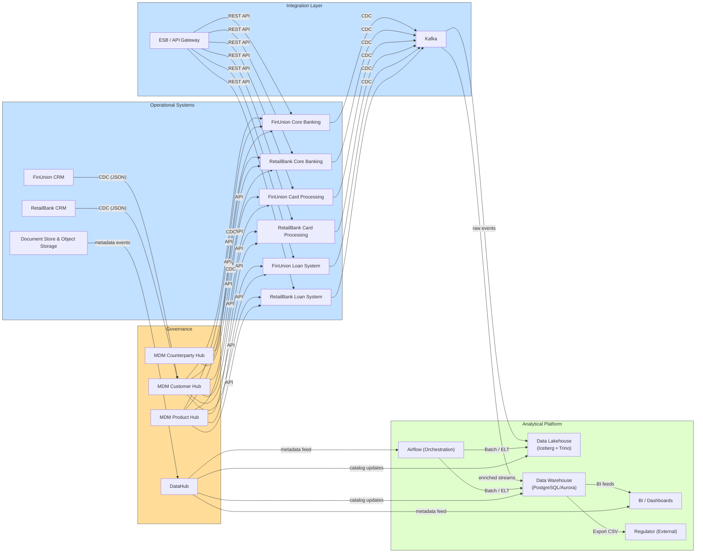

# Целевая архитектура данных (12 мес.)

### Компоненты

| Категория | Компонент | Краткое назначение | Технология (пример) |
|-----------|-----------|----------------------|----------------------|
| **Operational Systems** | Core Banking (FinUnion) | OLTP‑ядро, счета, договоры, операции | Oracle / PostgreSQL‑core |
| | Core Banking (Retail) – постепенно выводится | Переход к унифицированному ядру | — |
| | CRM (FinUnion + Retail) | Управление клиентской информацией | Salesforce‑like / собственный |
| | Card Processing (FinUnion) | Выпуск и обработка карт, события | Visa/MC‑compatible |
| | Loan System (FinUnion) | Управление кредитным портфелем | Custom loan‑engine |
| | Document Store | Хранение сканов договоров, паспортов | S3‑compatible Object Store |
| **MDM** | Customer Hub | “Золотая запись” клиента, дедупликация | Informatica MDM / Profisee |
| | Product & Counterparty Hub | Справочники продуктов, тарифов, контрагентов | Same MDM platform |
| **Integration Layer** | Enterprise Service Bus (ESB) | Синхронный API‑шлюз (REST/SOAP) | MuleSoft / WSO2 |
| | Event Bus (Kafka) | Асинхронные события (CDC, бизнес‑события) | Apache Kafka (kRaft) |
| | Mapping & Validation Service | Правила трансформации, очистка | KSQL / Kafka Streams |
| **Data Lakehouse** | Data Lake (Iceberg) | Хранилище сырых/партиционированных файлов | Apache Iceberg on S3 |
| | Query Engine | Универсальный SQL‑доступ к lakehouse | Trino (Presto) |
| **DWH** | Регламентированное хранилище | Финальная отчётность, агрегаты | PostgreSQL‑based DWH (Amazon Aurora) |
| **Orchestration** | Airflow | Планирование и мониторинг batch‑/ELT‑задач | Apache Airflow |
| **Catalog** | DataHub | Метаданные, lineage, владельцы, семантика | DataHub (LinkedIn) |
| **BI** | Витрины и дашборды | Управленческая, регуляторная аналитика | Looker / Power BI |
| **Security / Governance** | Centralized IAM, Data Masking, Encryption | Защита ПДн, контроль доступа | HashiCorp Vault, Apache Ranger |

### Поток данных

1. **CDC** из всех operational‑систем → **Kafka** → **MDM** (для клиентских данных) и **Lakehouse** (сырые события).  
2. **ELT** из **Lakehouse** → **DWH** (агрегаты, финансовые отчёты) через **Airflow** + **dbt**.  
3. **API‑Gateway** из **Integration Layer** → **CRM / Core** для синхронных запросов (баланс, статус карты).  
4. **DataHub** хранит метаданные обоих хранилищ, делает lineage доступным для BI и аудиторов.  

### Принципы

* **Непрерывность** – никакой downtime для клиентских сервисов. Все потоки работают в **near‑real‑time** через Kafka, а batch‑потоки – в‑ночные окна.  
* **Разделение OLTP / OLAP** – operational‑systems обслуживают транзакции, аналитика – только из DWH/Lakehouse.  
* **Data‑Governance** – единые политики шифрования, маскирования и RBAC реализованы в DataHub и в хранилищах.  

